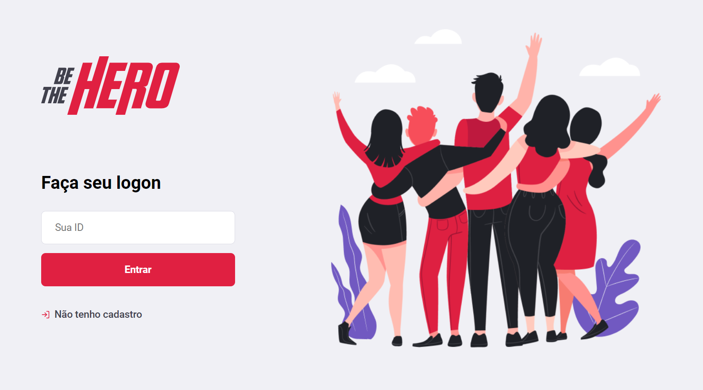
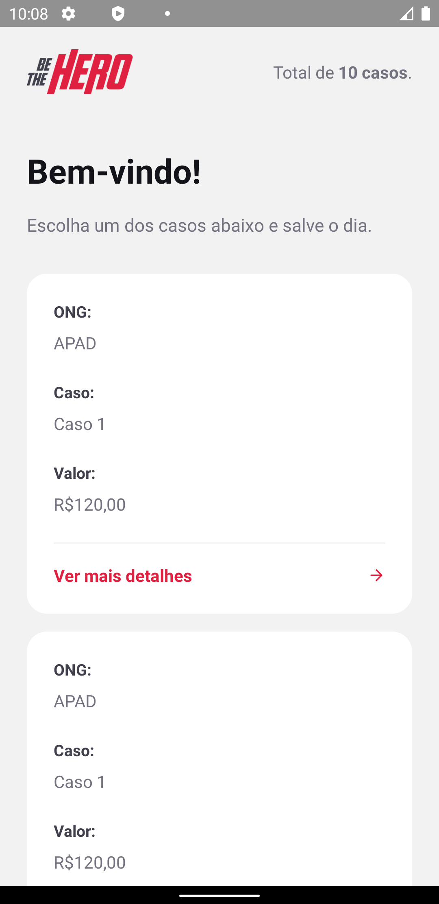
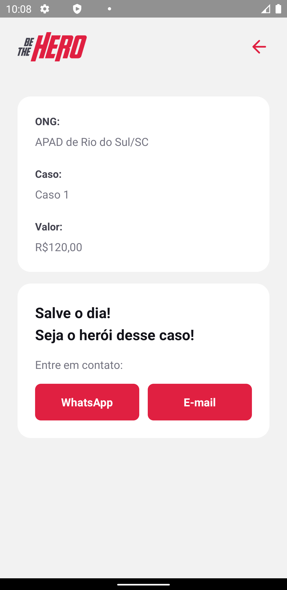

# Be The Hero

 

  
  

### Tecnologias usadas
- Back-end:
  - [Node.js](https://nodejs.org/en/) :
    - [Express](https://expressjs.com/pt-br/)
    - [Nodemon](https://www.npmjs.com/package/nodemon)
    - [Cors](https://expressjs.com/en/resources/middleware/cors.html)
    - [Jest](https://jestjs.io/pt-BR/)
    - [Knex](http://knexjs.org/)

- Front-end:
  - [React](https://pt-br.reactjs.org/) :
    - [Axios](https://github.com/axios/axios)
    - [React router dom](https://reacttraining.com/react-router/web/guides/quick-start)

- Mobile:
  - [React Native](https://reactnative.dev/)
    - [Expo](https://expo.io/)
    - [Mail Composer](https://docs.expo.io/versions/latest/sdk/mail-composer/)
    - [Axios](https://github.com/axios/axios)
    

  

  
  

